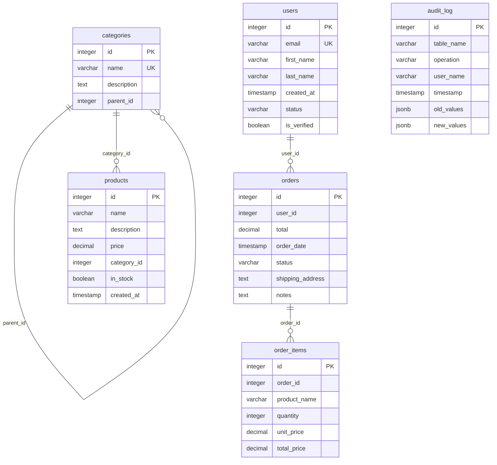

# PostgreSQL Database Documentation

Generated on: 2025-07-14 22:53:56

## Table of Contents

- [Database Summary](#database-summary)
- [PostgreSQL Extensions](#postgresql-extensions)
- [Views](#views)
- [Sequences](#sequences)
- [Database Relationships](#database-relationships)
- [Tables](#tables)
  - [audit_log](#audit-log)
  - [categories](#categories)
  - [order_items](#order-items)
  - [orders](#orders)
  - [products](#products)
  - [users](#users)

## Database Summary

**Total Tables:** 6
**Total Rows:** 47

## PostgreSQL Extensions

| Extension | Version | Schema |
|-----------|---------|--------|
| pg_stat_statements | 1.10 | public |
| uuid-ossp | 1.1 | public |

## Views

| View | Schema |
|------|--------|
| active_users | public |
| order_summary | public |
| pg_stat_statements | public |
| pg_stat_statements_info | public |

## Sequences

| Sequence | Schema | Data Type | Start | Min | Max | Increment |
|----------|--------|-----------|-------|-----|-----|----------|
| audit_log_id_seq | public | integer | 1 | 1 | 2147483647 | 1 |
| categories_id_seq | public | integer | 1 | 1 | 2147483647 | 1 |
| order_items_id_seq | public | integer | 1 | 1 | 2147483647 | 1 |
| orders_id_seq | public | integer | 1 | 1 | 2147483647 | 1 |
| products_id_seq | public | integer | 1 | 1 | 2147483647 | 1 |
| users_id_seq | public | integer | 1 | 1 | 2147483647 | 1 |

## Database Relationships

## Tables

## audit_log

### Columns

| Column | Type | Nullable | Constraints | Default |
|--------|------|----------|-------------|---------|
| id | integer | NO | PRIMARY KEY | nextval('audit_log_id_seq'::regclass) |
| table_name | character varying(50) | NO |  |  |
| operation | character varying(10) | NO |  |  |
| user_name | character varying(100) | YES |  | CURRENT_USER |
| timestamp | timestamp without time zone | YES |  | CURRENT_TIMESTAMP |
| old_values | jsonb | YES |  |  |
| new_values | jsonb | YES |  |  |

### Indexes

| Name | Type | Columns | Method |
|------|------|---------|--------|
| audit_log_pkey | PRIMARY KEY | id | btree |

---

## categories

Row Count: 6

### Columns

| Column | Type | Nullable | Constraints | Default |
|--------|------|----------|-------------|---------|
| id | integer | NO | PRIMARY KEY | nextval('categories_id_seq'::regclass) |
| name | character varying(100) | NO | UNIQUE |  |
| description | text | YES |  |  |
| parent_id | integer | YES |  |  |

### Indexes

| Name | Type | Columns | Method |
|------|------|---------|--------|
| categories_pkey | PRIMARY KEY | id | btree |
| categories_name_key | UNIQUE | name | btree |

---

## order_items

Row Count: 13

### Columns

| Column | Type | Nullable | Constraints | Default |
|--------|------|----------|-------------|---------|
| id | integer | NO | PRIMARY KEY | nextval('order_items_id_seq'::regclass) |
| order_id | integer | NO |  |  |
| product_name | character varying(255) | NO |  |  |
| quantity | integer | NO |  | 1 |
| unit_price | numeric | NO |  |  |
| total_price | numeric | YES |  |  |

### Indexes

| Name | Type | Columns | Method |
|------|------|---------|--------|
| order_items_pkey | PRIMARY KEY | id | btree |
| idx_order_items_order_id | INDEX | order_id | btree |

---

## orders

Row Count: 10

### Columns

| Column | Type | Nullable | Constraints | Default |
|--------|------|----------|-------------|---------|
| id | integer | NO | PRIMARY KEY | nextval('orders_id_seq'::regclass) |
| user_id | integer | NO |  |  |
| total | numeric | NO |  | 0.00 |
| order_date | timestamp without time zone | YES |  | CURRENT_TIMESTAMP |
| status | character varying(20) | YES |  | 'pending'::character varying |
| shipping_address | text | YES |  |  |
| notes | text | YES |  |  |

### Indexes

| Name | Type | Columns | Method |
|------|------|---------|--------|
| orders_pkey | PRIMARY KEY | id | btree |
| idx_orders_date | INDEX | order_date | btree |
| idx_orders_total_range | INDEX | total | btree |
| idx_orders_user_id | INDEX | user_id | btree |

### Triggers

| Name | Event | Timing | Function | Orientation |
|------|-------|--------|----------|-------------|
| order_validation_trigger | INSERT,UPDATE | BEFORE | validate_order | ROW |
| orders_audit_trigger | INSERT,DELETE,UPDATE | AFTER | audit_trigger | ROW |

---

## products

Row Count: 8

### Columns

| Column | Type | Nullable | Constraints | Default |
|--------|------|----------|-------------|---------|
| id | integer | NO | PRIMARY KEY | nextval('products_id_seq'::regclass) |
| name | character varying(255) | NO |  |  |
| description | text | YES |  |  |
| price | numeric | NO |  |  |
| category_id | integer | YES |  |  |
| in_stock | boolean | YES |  | true |
| created_at | timestamp without time zone | YES |  | CURRENT_TIMESTAMP |

### Indexes

| Name | Type | Columns | Method |
|------|------|---------|--------|
| products_pkey | PRIMARY KEY | id | btree |
| idx_products_category_id | INDEX | category_id | btree |
| idx_products_price_btree | INDEX | price | btree |

---

## users

Row Count: 10

### Columns

| Column | Type | Nullable | Constraints | Default |
|--------|------|----------|-------------|---------|
| id | integer | NO | PRIMARY KEY | nextval('users_id_seq'::regclass) |
| email | character varying(255) | NO | UNIQUE |  |
| first_name | character varying(100) | NO |  |  |
| last_name | character varying(100) | NO |  |  |
| created_at | timestamp without time zone | YES |  | CURRENT_TIMESTAMP |
| status | character varying(20) | YES |  | 'active'::character varying |
| is_verified | boolean | YES |  | false |

### Indexes

| Name | Type | Columns | Method |
|------|------|---------|--------|
| users_pkey | PRIMARY KEY | id | btree |
| users_email_key | UNIQUE | email | btree |
| idx_users_email | INDEX | email | btree |
| idx_users_status_verified | INDEX | status, is_verified | btree |

### Triggers

| Name | Event | Timing | Function | Orientation |
|------|-------|--------|----------|-------------|
| users_audit_trigger | INSERT,DELETE,UPDATE | AFTER | audit_trigger | ROW |
