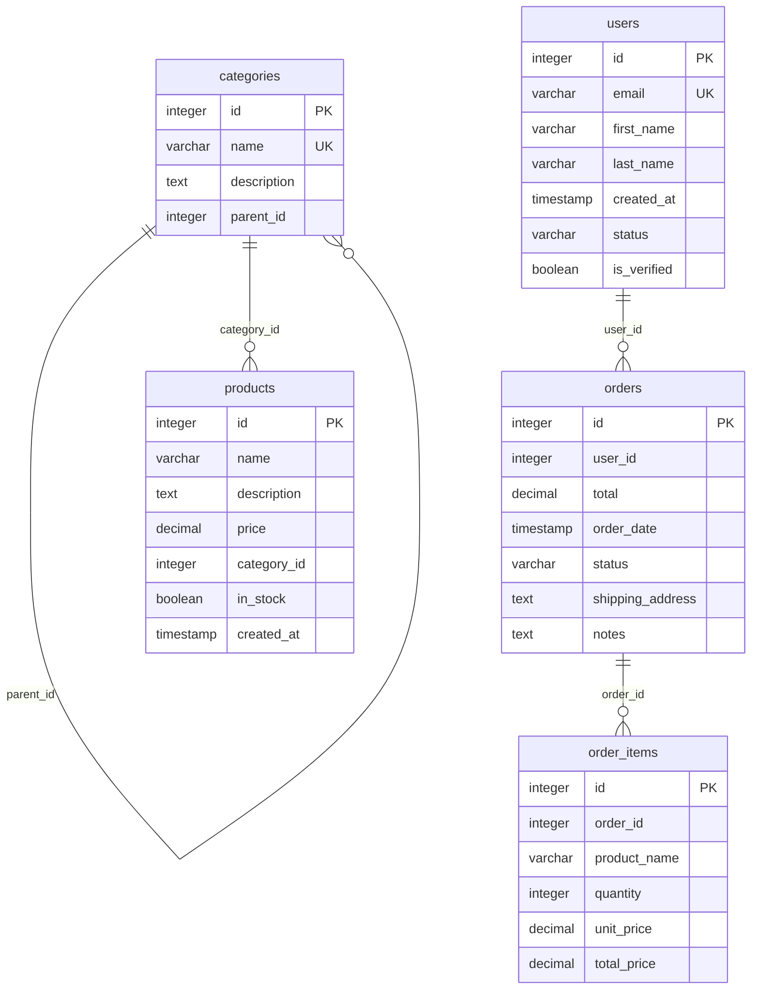

# PostgreSQL Database Documentation

Generated on: 2025-07-14 21:50:16

## Table of Contents

- [Database Summary](#database-summary)
- [Database Relationships](#database-relationships)
- [Tables](#tables)
  - [categories](#categories)
  - [order_items](#order-items)
  - [orders](#orders)
  - [products](#products)
  - [users](#users)

## Database Summary

**Total Tables:** 5
**Total Rows:** 47

## Database Relationships

## Tables

## categories

Row Count: 6

### Columns

| Column | Type | Nullable | Constraints | Default |
|--------|------|----------|-------------|---------|
| id | integer | NO | PRIMARY KEY | nextval('categories_id_seq'::regclass) |
| name | character varying(100) | NO | UNIQUE |  |
| description | text | YES |  |  |
| parent_id | integer | YES |  |  |

---

## order_items

Row Count: 13

### Columns

| Column | Type | Nullable | Constraints | Default |
|--------|------|----------|-------------|---------|
| id | integer | NO | PRIMARY KEY | nextval('order_items_id_seq'::regclass) |
| order_id | integer | NO |  |  |
| product_name | character varying(255) | NO |  |  |
| quantity | integer | NO |  | 1 |
| unit_price | numeric | NO |  |  |
| total_price | numeric | YES |  |  |

---

## orders

Row Count: 10

### Columns

| Column | Type | Nullable | Constraints | Default |
|--------|------|----------|-------------|---------|
| id | integer | NO | PRIMARY KEY | nextval('orders_id_seq'::regclass) |
| user_id | integer | NO |  |  |
| total | numeric | NO |  | 0.00 |
| order_date | timestamp without time zone | YES |  | CURRENT_TIMESTAMP |
| status | character varying(20) | YES |  | 'pending'::character varying |
| shipping_address | text | YES |  |  |
| notes | text | YES |  |  |

---

## products

Row Count: 8

### Columns

| Column | Type | Nullable | Constraints | Default |
|--------|------|----------|-------------|---------|
| id | integer | NO | PRIMARY KEY | nextval('products_id_seq'::regclass) |
| name | character varying(255) | NO |  |  |
| description | text | YES |  |  |
| price | numeric | NO |  |  |
| category_id | integer | YES |  |  |
| in_stock | boolean | YES |  | true |
| created_at | timestamp without time zone | YES |  | CURRENT_TIMESTAMP |

---

## users

Row Count: 10

### Columns

| Column | Type | Nullable | Constraints | Default |
|--------|------|----------|-------------|---------|
| id | integer | NO | PRIMARY KEY | nextval('users_id_seq'::regclass) |
| email | character varying(255) | NO | UNIQUE |  |
| first_name | character varying(100) | NO |  |  |
| last_name | character varying(100) | NO |  |  |
| created_at | timestamp without time zone | YES |  | CURRENT_TIMESTAMP |
| status | character varying(20) | YES |  | 'active'::character varying |
| is_verified | boolean | YES |  | false |
